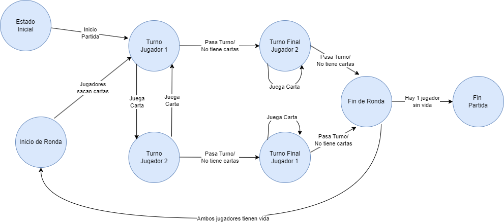

# Gwen't

This work is licensed under a
[Creative Commons Attribution 4.0 International License](http://creativecommons.org/licenses/by/4.0/)

Context
-------

This project's goal is to create a (simplified) clone of the
[_Gwent_](https://www.playgwent.com/en) card game developed by [_CD PROJEKT RED_](https://cdprojektred.com/en/)

---
## Diagrama de estados

## Game Structure

### Players

The game was made considering one human player and one computer, internally in the code referred as _Player1_ 
and _Player2_. Both are created with a Player class that follow a Player interface.

### Cards

The cards share a common interface for both Unit Cards and Weather Cards, Unit Cards also extends a Unit Card 
interface and may have a Card Effect attached when being instantiated. Weather Cards must have a Card Effect 
attached to them and a boolean 3-tuple which represents which unit cards will be affected by this particular 
card (Melee Card, Ranged Card and Siege Card, in that order). It is assumed that unit cards will only ever
affect the cards that share the same row in the board as them.

#### Effects

Card Effects are another class which encapsulate the behaviour of a card when being played. They contain a name,
description and function that must be passed to the constructor. This function contains all the logic for how and
why the effects are applied, and to which cards they are applied. This structure was chosen to promote modularity
in the way that cards and their effects are handled in the game.

### Board

The board is a simple class that contains two Board Sections (another class), a place for a weather card, and knows
which players are associated with the particular instance of the game. The unit card placement is handled by the board
sections since they are the ones responsible for holding onto them in rows. There is one board section per player. They 
also have the capability to call the effects of the cards being played and calculate the total strength of the cards in
their control, since this is required for the game to play.

### Game Controller

This class is responsible for handling the state flow of the game, doing this by following the state pattern. The possible
states of the game and the actions required to transition between them are shown in the state diagram above. 